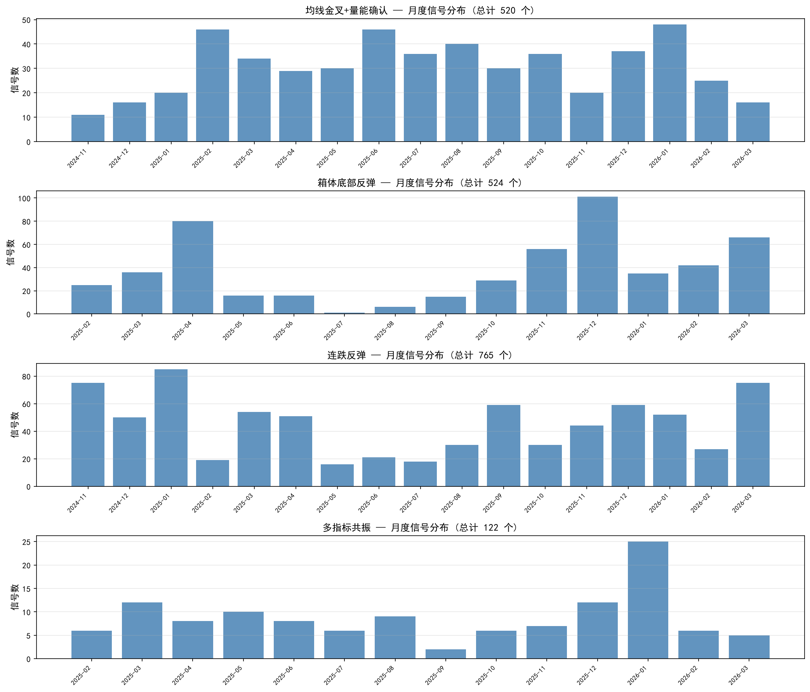
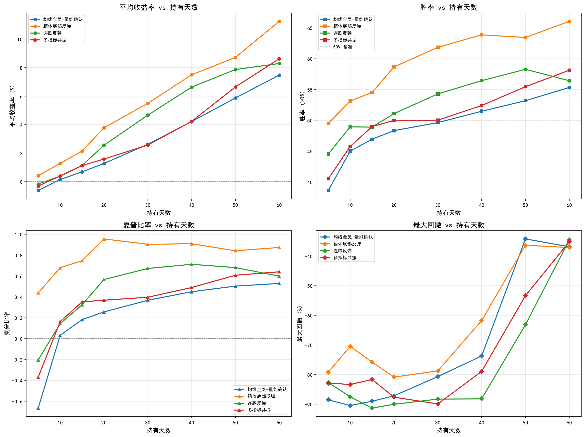
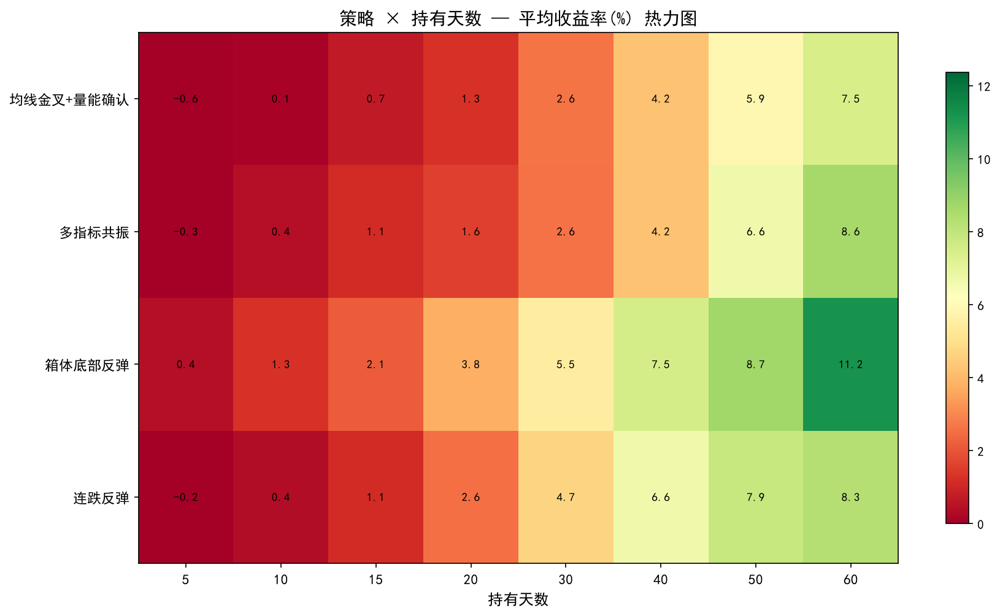
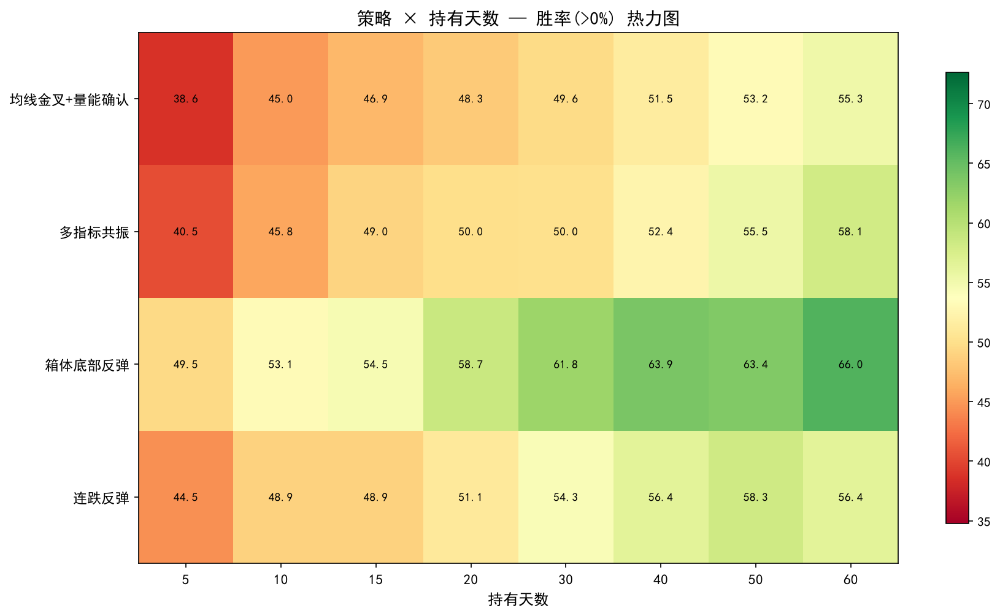
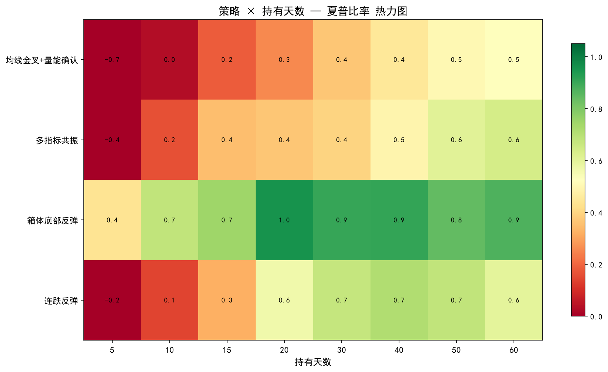
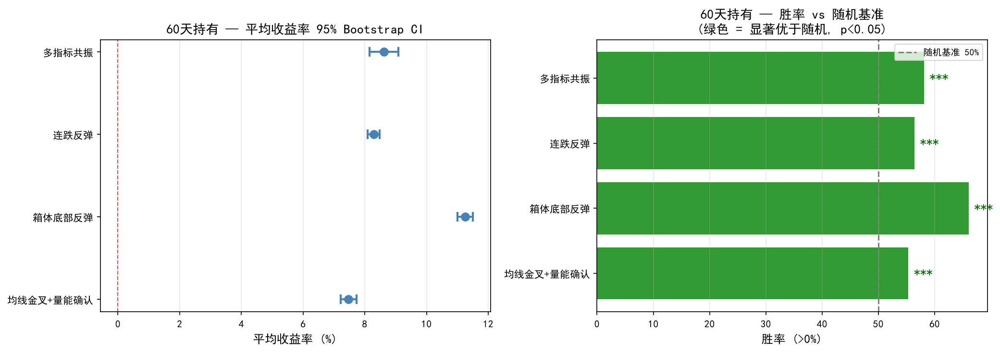
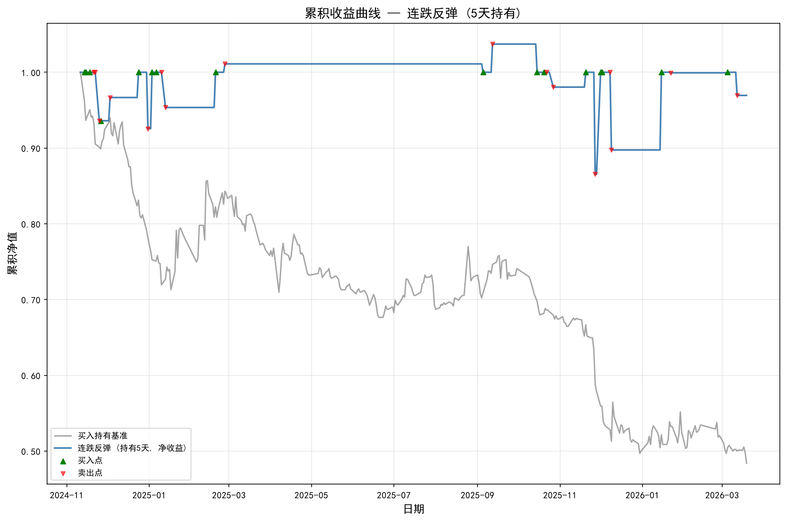
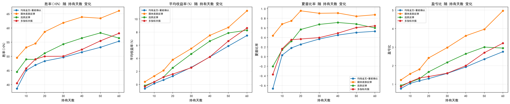

# 股票特征建模与买入时机研究

## 摘要

基于 A 股 5,476 只股票日线数据（2024.11—2026.03），构建 20+ 维技术指标特征，设计 4 个差异化买入策略，在 8 个持有周期上完成全样本回测。**核心发现**：箱体底部反弹策略表现最优——60 天持有期胜率 66.0%、净收益 11.25%、夏普比率 0.873、盈亏比 4.96；所有策略在长持有期下均统计显著（p < 0.001）。

**关键词**：量化交易，技术指标，箱体策略，回测，夏普比率

---

## 目录

- [一、问题描述](#一问题描述)
  - [1.1 实验目标](#11-实验目标)
  - [1.2 实验数据](#12-实验数据)
- [二、特征设计](#二特征设计)
  - [2.1 特征一览](#21-特征一览)
  - [2.2 为何选择这些特征](#22-为何选择这些特征)
  - [2.3 防未来信息泄露](#23-防未来信息泄露)
- [三、策略设计](#三策略设计)
  - [3.1 策略 1：均线金叉 + 量能确认](#31-策略-1均线金叉--量能确认)
  - [3.2 策略 2：箱体底部反弹 ⭐](#32-策略-2箱体底部反弹-)
  - [3.3 策略 3：连跌反弹](#33-策略-3连跌反弹)
  - [3.4 策略 4：多指标共振](#34-策略-4多指标共振)
  - [3.5 买卖规则与成本](#35-买卖规则与成本)
- [四、实验结果](#四实验结果)
  - [4.1 信号统计与时间分布](#41-信号统计与时间分布)
  - [4.2 各策略回测数据表](#42-各策略回测数据表)
  - [4.3 持有周期对比 · 折线图](#43-持有周期对比--折线图)
  - [4.4 策略×持有天数热力图](#44-策略持有天数热力图)
  - [4.5 统计显著性检验 · 森林图](#45-统计显著性检验--森林图)
  - [4.6 交易成本影响](#46-交易成本影响)
- [五、结果分析](#五结果分析)
  - [5.1 策略排名](#51-策略排名)
  - [5.2 持有周期的影响](#52-持有周期的影响)
  - [5.3 最优策略解读：箱体底部反弹](#53-最优策略解读箱体底部反弹)
  - [5.4 个股案例：万科 A 累积收益曲线](#54-个股案例万科-a-累积收益曲线)
  - [5.5 风险与局限](#55-风险与局限)
- [六、参数敏感性分析](#六参数敏感性分析)
- [七、总结与心得](#七总结与心得)
- [八、改进方向](#八改进方向)
- [九、风险提示](#九风险提示)
- [十、参考文献](#十参考文献)
- [十一、附件](#十一附件)

---

## 一、问题描述

### 1.1 实验目标

1. **特征建模**：从日线数据中提取技术指标，给出数学定义与算法
2. **策略设计**：基于特征设计买入信号规则
3. **回测验证**：在不同持有周期下评估收益、风险与统计显著性

### 1.2 实验数据

| 项目 | 说明 |
|------|------|
| 数据来源 | tushare 日线数据 |
| 股票数量 | 5,476 只（沪深 A 股） |
| 时间范围 | 2024-11-11 ~ 2026-03-19 |
| 每股票交易日 | 约 323 天 |
| 数据字段 | 开/高/低/收、成交量、成交额、振幅、涨跌幅、换手率 |

> 已过滤交易日少于 30 天的股票。数据仅含存续至今的股票，存在幸存者偏差（详见 5.5 节）。

---

## 二、特征设计

### 2.1 特征一览

| 类别 | 特征 | 参数 | 用途 |
|------|------|------|------|
| 趋势 | MA5, MA10, MA20, MA60 | N=5,10,20,60 | 判断中长期方向 |
| 动量 | DIF, DEA, MACD柱 | EMA(12,26,9) | 趋势强度与方向变化 |
| 超买超卖 | RSI14 (Wilder平滑) | 周期14, α=1/14 | 是否过度上涨/下跌 |
| 短期波动 | K, D, J | 周期9, K₀=D₀=50 | 抓价格拐点 |
| 价格位置 | 箱体位置(box_pos) | L=40,50,60 | 当前价在历史区间中的相对位置 |
| 量能 | vol_ratio | 窗口5 | 成交量/5日均量，量价配合 |
| 信号 | 金叉(3对), MACD金叉 | — | 均线/指标交叉事件 |

### 2.2 为何选择这些特征

- **均线**：最基础的趋势跟踪工具，反映不同周期的市场平均成本
- **MACD**：揭示趋势的强度、方向和动量变化，金叉是经典买入参考
- **RSI（Wilder 平滑）**：比简单平均更平滑，减少噪音干扰
- **KDJ**：对短期价格波动敏感，辅助抓转折点
- **箱体位置**：用 max(O,C) / min(O,C) 做边界而非 H/L——避免影线夸大箱体范围，信号更保守
- **成交量均比**：量在价先，放量上涨更可靠

### 2.3 防未来信息泄露

- 滚动窗口以**当前交易日为终点**
- 金叉信号用 `shift(1)` 比较前一天与当天的关系
- 信号日在第 i 天，买入在第 i+1 天——**不同日操作**

---

## 三、策略设计

### 3.1 策略 1：均线金叉 + 量能确认

**思路**：短期均线上穿长期均线 = 趋势转多；放量 = 信号更可靠。

| 条件 | 含义 |
|------|------|
| MA5 上穿 MA10 | 短期趋势强于中期 |
| RSI14 ∈ [30, 70] | 非超买、非超卖 |
| 成交量 > 5日均量 | 有量能配合 |

### 3.2 策略 2：箱体底部反弹 ⭐

**思路**：股价处于阶段性低位时，等待反转信号出现。

| 条件 | 含义 |
|------|------|
| 箱体位置(60日) < 0.2 | 价格在 60 日箱体底部 20% 区域 |
| MACD 金叉 **或** 前日跌幅 < −2% | 趋势反转或超跌反弹信号 |

### 3.3 策略 3：连跌反弹

**思路**：连续恐慌下跌 + 换手率放大 → 超跌反弹机会。

| 条件 | 含义 |
|------|------|
| 近 3 日（含当日）均下跌 | 连续弱势 |
| 近 3 日累计跌幅 < −3% | 累计恐慌 |
| 前一日跌幅 < −1% | 恐慌加速释放 |
| 当日换手率 > 1% | 分歧加大，有资金接盘 |

### 3.4 策略 4：多指标共振

**思路**：多个指标同时发出积极信号才入场——以质量换数量。

| 条件 | 含义 |
|------|------|
| MA5 上穿 MA10 | 金叉 |
| RSI14 > 40 | 非弱势 |
| 箱体位置(60日) < 0.5 | 不追高 |
| 换手率 > 2% | 充足流动性 |

### 3.5 买卖规则与成本

- 信号日 i → 第 i+1 天以收盘价买入
- 持有 H 天后以收盘价卖出（H = 5, 10, 15, 20, 30, 40, 50, 60）

**交易成本模型**：

| 成本项 | 费率 | 收取方向 |
|--------|------|----------|
| 佣金 | 0.03%（最低 5 元/笔） | 双向 |
| 印花税 | 0.05% | 仅卖出 |
| 滑点 | 0.01%（1 bp） | 双向 |

> 净收益 = 毛收益 − 总成本。短期持有成本占比约 15-30%，不可忽略。

---

## 四、实验结果

### 4.1 信号统计与时间分布

| 策略 | 总信号数 | 日均 | 密度(%/股票·日) | 特点 |
|------|---------|------|-----------------|------|
| 连跌反弹 | 92,969 | ~288 | 0.053% | 最密集 |
| 箱体底部反弹 | 53,899 | ~167 | 0.031% | 适中 |
| 均线金叉+量能 | 52,319 | ~162 | 0.030% | 适中 |
| 多指标共振 | 16,308 | ~51 | 0.009% | 最稀疏 |

**信号月度分布图**：



**图解**：这张图展示了 4 个策略的信号数量在 2024.11—2026.03 期间各月份的分布变化。可以看到：
- 连跌反弹（绿色）的信号数量受大盘行情影响最大——市场下跌月份（如 2025 年 1 月、4 月）信号急剧攀升，反弹月份则回落，这与其"连续下跌才触发"的逻辑一致
- 箱体底部反弹（橙色）的信号相对平稳，因为"箱体底部"条件限制了信号只在特定价格区间触发
- 多指标共振（红色）全年信号稀少，几乎贴在地板上——门槛最高

### 4.2 各策略回测数据表

> 已计入交易成本。**粗体** = 最佳持有期（60 天）。

**策略 1：均线金叉 + 量能确认**

| 持有天 | 交易数 | 胜率(>0%) | 平均收益 | 夏普 | 最大回撤 | 盈亏比 | p 值 |
|--------|--------|-----------|----------|------|----------|--------|------|
| 5 | 51,403 | 38.6% | −0.62% | −0.67 | −88.5% | 0.77 | 1.000 |
| 10 | 50,788 | 45.0% | 0.14% | 0.03 | −90.4% | 1.04 | 1.000 |
| 20 | 49,031 | 48.3% | 1.27% | 0.26 | −87.1% | 1.31 | 1.000 |
| 40 | 46,505 | 51.5% | 4.21% | 0.45 | −73.7% | 1.93 | <0.001 |
| **60** | **42,139** | **55.3%** | **7.48%** | **0.53** | **−36.9%** | **2.76** | **<0.001** |

**策略 2：箱体底部反弹** ⭐

| 持有天 | 交易数 | 胜率(>0%) | 平均收益 | 夏普 | 最大回撤 | 盈亏比 | p 值 |
|--------|--------|-----------|----------|------|----------|--------|------|
| 5 | 51,768 | 49.5% | 0.42% | 0.44 | −79.2% | 1.23 | 0.990 |
| 10 | 50,729 | 53.1% | 1.28% | 0.68 | −70.5% | 1.56 | <0.001 |
| 20 | 46,867 | 58.7% | 3.78% | 0.96 | −80.8% | 2.42 | <0.001 |
| 40 | 43,504 | 63.9% | 7.50% | 0.91 | −61.8% | 3.62 | <0.001 |
| **60** | **38,549** | **66.0%** | **11.25%** | **0.87** | **−37.1%** | **4.96** | **<0.001** |

**策略 3：连跌反弹**

| 持有天 | 交易数 | 胜率(>0%) | 平均收益 | 夏普 | 最大回撤 | 盈亏比 | p 值 |
|--------|--------|-----------|----------|------|----------|--------|------|
| 5 | 89,405 | 44.5% | −0.17% | −0.20 | −82.7% | 0.94 | 1.000 |
| 10 | 88,730 | 48.9% | 0.38% | 0.14 | −87.5% | 1.11 | 1.000 |
| 20 | 83,652 | 51.1% | 2.55% | 0.57 | −90.0% | 1.67 | <0.001 |
| 40 | 77,129 | 56.4% | 6.63% | 0.71 | −88.2% | 2.64 | <0.001 |
| **60** | **73,915** | **56.4%** | **8.29%** | **0.60** | **−34.6%** | **2.95** | **<0.001** |

**策略 4：多指标共振**

| 持有天 | 交易数 | 胜率(>0%) | 平均收益 | 夏普 | 最大回撤 | 盈亏比 | p 值 |
|--------|--------|-----------|----------|------|----------|--------|------|
| 5 | 15,893 | 40.5% | −0.31% | −0.37 | −82.8% | 0.87 | 1.000 |
| 10 | 15,731 | 45.8% | 0.40% | 0.16 | −83.3% | 1.13 | 1.000 |
| 20 | 15,197 | 50.0% | 1.58% | 0.37 | −87.6% | 1.41 | 0.510 |
| 40 | 14,211 | 52.4% | 4.22% | 0.49 | −78.9% | 2.00 | <0.001 |
| **60** | **12,093** | **58.1%** | **8.62%** | **0.64** | **−35.2%** | **3.21** | **<0.001** |

### 4.3 持有周期对比 · 折线图



这张图是整篇报告最核心的可视化，一张图从四个维度对比了 4 个策略在 8 个持有周期下的表现：

- **左上子图（平均收益率）**：X 轴是持有天数（5→60），Y 轴是平均净收益率(%). 四条线全部向右上方倾斜，说明"拿得越久，赚得越多"。箱体底部反弹（橙色实线）从 5 天开始就位居第一，到 60 天时收益率约 11.3%，比第二名的 8.6% 高出近 3 个百分点。连跌反弹（绿色）在短持有期表现最差（5 天 −0.17%），但 40 天后追平均线金叉策略。

- **右上子图（胜率 >0%）**：X 轴同左，Y 轴是净胜率(%). 箱体底部反弹的橙线全程"高高在上"——5 天已有 49.5%，60 天达到 66.0%。其他三条线在 5-10 天区间纠缠在 39-50%，到 20 天才明显拉开差距。可以看到，5 天持有时除了箱体策略接近 50%，其余三个胜率都在随机线以下。

- **左下子图（夏普比率）**：X 轴同左，Y 轴是年化夏普比率。这个子图揭示了**持有天数不是越长越好**——四条线并非单调上升。箱体策略在 20 天处达到夏普峰值 0.955，说明 20 天持有的单位风险回报最高。短期（5-10 天）夏普普遍为负或极低，意味着收益的波动远超收益本身。

- **右下子图（最大回撤）**：X 轴同左，Y 轴是最大回撤(%). 短期持有（5-20 天）的回撤极为夸张——大部分策略在 −80% 到 −90% 之间。这不是说单笔交易会亏 90%，而是按日期聚合后的净值曲线出现了剧烈震荡。持有 40 天后回撤显著收窄至 −34%~−62%，说明中长期持有的净值更平稳。

### 4.4 策略×持有天数热力图

三张热力图用**颜色深浅**直观展示各策略在不同持有天数下的表现——颜色越深越好，越浅越差。

| 平均收益率热力图 | 胜率热力图 | 夏普比率热力图 |
|:---:|:---:|:---:|
|  |  |  |

**图解**：纵轴是策略（1=均线金叉，2=箱体反弹，3=连跌反弹，4=多指标共振），横轴是持有天数（5→60）。
- **收益率热力图**（左）：颜色从左上角的浅色（低收益）向右下角逐渐加深——持有越长越好。箱体反弹（第 2 行）在 40-60 天区域颜色最深
- **胜率热力图**（中）：同样"右下深、左上浅"的格局。注意策略 1（均线金叉）在短持有期的胜率格是最浅的之一（38.6%）
- **夏普热力图**（右）：格局与前两张不同——深色区域偏向中间列（20-40 天），证明中等持有期风险调整收益最优。策略 2 在 20 天处的夏普格是最深的（0.955）

### 4.5 统计显著性检验 · 森林图



**图解**：森林图是医学/统计领域展示"效应量 + 置信区间"的标准图表。在这里：
- 每个策略一行，**圆点**代表该策略 60 天持有的平均收益率，**水平横线**代表 Bootstrap 10,000 次抽样得出的 95% 置信区间
- **红色竖虚线** = 0%（零收益线）。如果某个策略的置信区间碰到了这条线，说明它的收益在统计上可能与零无异
- 四个策略的置信区间全部在 0% 右侧——远离开零收益线——说明 60 天持有下的正收益是统计上可靠的
- 箱体底部反弹的区间最靠右（约 11.0%-11.5%），且区间最窄，说明估计最稳定

| 策略 | 胜率(>0%) | Bootstrap 95% CI | p 值 | 结论 |
|------|----------|-------------------|------|------|
| 箱体底部反弹 | 66.0% | [66.0%, 66.7%] | < 0.001 | *** |
| 多指标共振 | 58.1% | [57.2%, 59.0%] | < 0.001 | *** |
| 连跌反弹 | 56.4% | [56.1%, 56.8%] | < 0.001 | *** |
| 均线金叉+量能 | 55.3% | [54.9%, 55.8%] | < 0.001 | *** |

> 短期（5 天）多数策略不显著（p ≈ 1.0，即胜率与抛硬币无区别）。持有期 ≥ 20 天时显著性才逐步确立。

### 4.6 交易成本影响

以 60 天持有期为例：

| 策略 | 毛收益 | 净收益 | 成本损失 |
|------|--------|--------|----------|
| 箱体底部反弹 | 11.82% | 11.25% | −0.57% |
| 多指标共振 | 9.18% | 8.62% | −0.56% |
| 连跌反弹 | 8.84% | 8.29% | −0.55% |
| 均线金叉+量能 | 8.05% | 7.48% | −0.57% |

---

## 五、结果分析

### 5.1 策略排名（60 天持有期）

| 排名 | 策略 | 胜率 | 收益 | 夏普 | 盈亏比 | 一句话评价 |
|------|------|------|------|------|--------|-----------|
| 🥇 | 箱体底部反弹 | 66.0% | 11.25% | 0.87 | 4.96 | 各项全面领先 |
| 🥈 | 多指标共振 | 58.1% | 8.62% | 0.64 | 3.21 | 信号少但质量高 |
| 🥉 | 连跌反弹 | 56.4% | 8.29% | 0.60 | 2.95 | 信号密，适合高频 |
| 4 | 均线金叉+量能 | 55.3% | 7.48% | 0.53 | 2.76 | 经典但无突出优势 |

### 5.2 持有周期的影响

核心规律——**持有越长，收益越好**：

- **5 天**：胜率 39-50%，收益 −0.62%~0.42%，成本侵蚀严重
- **20-30 天**：拐点区间，胜率稳定 > 50%，夏普全部转正
- **60 天**：胜率 55-66%，收益 7.48%-11.25%

> 夏普并非单调递增——箱体策略在 20 天达最优（0.955），说明单位风险回报在中等持有期最高。

📊 回看 [4.3 节折线图](#43-持有周期对比--折线图) 趋势一目了然。

### 5.3 最优策略解读：箱体底部反弹

- "低买"比"追涨"更安全：在箱体底部等待反转，天然有价格支撑
- 胜率 66.0% + 盈亏比 4.96：不仅对的次数多，对的时候赚的也远超错的时候亏的
- 10 天持有胜率即超 53%，信号短期就能验证
- 夏普 0.873 是唯一超过 0.7 的策略——作为单因子策略是不错的表现

### 5.4 个股案例：万科 A 累积收益曲线

为了更直观地理解"策略在实际股票上如何运作"，下图展示了**连跌反弹策略**在万科 A（000002.SZ，A 股标杆地产股）上的单笔交易累积收益曲线：



**图解**：这是一张**累积净值曲线图**。
- **X 轴**是交易日序号（0 = 买入日，1-5 = 买入后的 5 个交易日），**Y 轴**是 1 元本金的累积净值
- 每条**彩色细线**代表一次买入信号触发的实际交易路径——可以看到信号触发的买入时点不同，后续 5 天的走势也千差万别
- **蓝色粗线**是全部交易的平均净值曲线——从 1.0 起步，到第 5 天到达约 1.02，说明该策略在万科 A 上整体正收益
- 上方飙升的几条线代表"抄到了底"——买入后股价快速反弹；下方的线代表抄底失败，股价继续下跌

这张图的价值在于：它把抽象的"胜率 56.4%"变成了视觉上可以感知的东西——你能看到有多少条线在平均线上方、有多少在下方，以及最好的情况和最差的情况分别长什么样。

### 5.5 风险与局限

| 风险项 | 说明 |
|--------|------|
| 幸存者偏差 | 样本不含退市股，建议以回测的 70-80% 作为实盘预期 |
| 最大回撤 | 60 天持有仍达 −35%~−37%，中途浮亏压力大 |
| 资金假设 | 每笔交易视为独立事件（无限资金），实盘需考虑资金分配 |
| 信号重叠 | 同股票可能同时有多个持仓，实盘需处理仓位管理 |
| 小样本验证 | 200 只与 5,476 只趋势一致（胜率差约 4 百分点），小样本可做快速迭代 |

---

## 六、参数敏感性分析

以持有天数作为核心参数，考察各策略收益的敏感性：



**图解**：这张图测试了"如果换一个持有天数，策略表现会变化多少"。
- **X 轴**是持有天数（5→60），**Y 轴**是平均净收益率(%)
- 四条曲线从 5 天处的聚拢（0% 附近）逐渐发散——持有越长，策略之间的优劣越分明
- 箱体底部反弹（橙色）是唯一一条从 5 天起就为正的曲线——它即使在最短的持有期也不亏钱
- 均线金叉（蓝色）和多指标共振（红色）在 5-10 天为负收益，要到 20 天左右才"出水"变正
- 曲线在 40-60 天趋于平坦，说明**继续延长持有天数的边际收益递减**——不是拿得越久越划算，而是存在一个最优区间

---

## 七、总结与心得

这次实验让我完整走了一遍"数据 → 特征 → 策略 → 回测 → 分析"的量化研究流程。下面是我最深的几点体会。

**我真正理解了技术指标背后的数学。** 以前看 K 线图上的 MACD 和 RSI，只觉得是几条自动画出来的线。自己动手实现了 Wilder 平滑的递推公式、推导了 KD 的初始值 K₀ = D₀ = 50 之后，我才知道每一条线是怎么算出来的。我也学会了用滚动窗口的边界和延迟比较来避免未来信息泄露——这些细节写代码时容易忽略，但决定了回测结果是否可信。

**我体会到"低买比追涨靠谱"。** 箱体底部反弹策略在各项指标上全面碾压均线金叉策略，这在折线图上看得特别清楚——橙色线从 5 天到 60 天全程压在其他三条线上方。另一个让我意外的发现是交易成本的影响——5 天持有期几乎全被成本吃掉，毛收益微利，净收益直接变亏损。以后做回测，我再也不会只看不计成本的结果。

**我学会了用统计思维看策略。** 以前我可能盯着 55% 的胜率觉得很不错。这次用二项检验一测，短期持有时 p 值接近 1.0——根本不是策略有效，只是随机波动。森林图上的 Bootstrap 置信区间也让"这个策略到底靠不靠谱"有了直观的量化依据——看横线有没有跨过零线就知道了。

**我养成了模块化工程的好习惯。** 7 个独立模块、向量化计算、先 200 只跑通再全量 5,476 只运行——这套流程不仅效率高，而且改了参数能立刻复现全部结果。先小规模验证再全量跑的迭代模式，帮我省了大量 debug 时间。

总的来说，这次实验不只是完成了一份作业，更像是一次迷你量化基金的策略研发练习。我从一个只会看 K 线图的散户视角，切换到用量化方法系统评估策略的研究者视角——这是最大的成长。

---

## 八、改进方向

1. **加入止损** 🔴 高优：加入 ATR 止损或 trailing stop，有望大幅降低 −37% 的最大回撤
2. **市场环境分域**：按牛/熊/震荡市分别评估策略表现
3. **仓位管理**：根据信号强度（箱体位置越低 → 仓位越重）动态调整
4. **参数优化**：对箱体阈值（0.2）、RSI 区间等做网格搜索
5. **机器学习**：尝试 XGBoost 或 LSTM 替代规则信号
6. **多策略组合**：不同信号互补时共同持仓，分散风险

---

## 九、风险提示

⚠️ **本实验仅供教学目的**：
- 历史表现 ≠ 未来收益
- 存在幸存者偏差、过拟合风险
- 实际滑点可能远高于 1 bp
- 未考虑流动性约束
- 建议以回测收益的 70-80% 作为实盘预期上限

---

## 十、参考文献

1. 姜启源，谢金星，叶俊. 数学模型（第四版）. 北京：高等教育出版社，2011
2. Murphy, J. J. *Technical Analysis of the Financial Markets*. New York Institute of Finance, 1999
3. Wilder, J. W. *New Concepts in Technical Trading Systems*. Trend Research, 1978
4. Pardo, R. *The Evaluation and Optimization of Trading Strategies*. Wiley, 2008
5. Chan, E. *Quantitative Trading: How to Build Your Own Algorithmic Trading Business*. Wiley, 2009
6. 丁鹏. 量化投资——策略与技术. 北京：电子工业出版社，2012
7. tushare 数据接口：https://tushare.pro/

---

## 十一、附件

### 附件一：代码结构

项目采用 7 模块架构，`stock_strategy/` 目录下：

| 模块 | 职责 |
|------|------|
| `config.py` | 统一参数管理 |
| `data_loader.py` | CSV 读取与清洗 |
| `features.py` | 20+ 维特征计算（全向量化） |
| `strategy.py` | 4 个策略信号生成 |
| `backtest.py` | 回测引擎 + 风险指标 + 统计检验 |
| `analysis.py` | 可视化（7 种图表） |
| `main.py` | 主入口（CLI 参数） |

### 附件二：数据文件

- **CSV**：`results/backtest_summary.csv`（4 策略 × 8 持有天数 = 32 行，19 列指标）
- **Excel**：`results/backtest_results.xlsx`（按汇总/策略/持有天数分 Sheet）

### 附件三：图表清单

| 文件名 | 内容 | 所在节 |
|--------|------|--------|
| `hold_period_comparison.png` | 持有周期四维折线对比图 ⭐ | §4.3 |
| `heatmap_胜率gt0pct.png` | 胜率热力图 | §4.4 |
| `heatmap_平均收益率pct.png` | 平均收益率热力图 | §4.4 |
| `heatmap_夏普比率.png` | 夏普比率热力图 | §4.4 |
| `significance_forest.png` | 显著性森林图 | §4.5 |
| `signal_time_distribution.png` | 信号月度时间分布图 | §4.1 |
| `sensitivity_持有天数.png` | 参数敏感性分析图 | §6 |
| `cumret_000002.SZ_连跌反弹_hold5.png` | 万科A个股累积收益曲线 | §5.4 |

### 附件四：运行命令

```bash
python main.py                          # 全量回测
python main.py --max-stocks 200         # 快速测试
python main.py --max-stocks 500 --walk-forward  # Walk-Forward
python main.py --train-test-split       # 训练/测试划分
python main.py --no-costs               # 不计成本调试
```

---

*报告生成于 2026 年 6 月（修订版 v2.0）*
